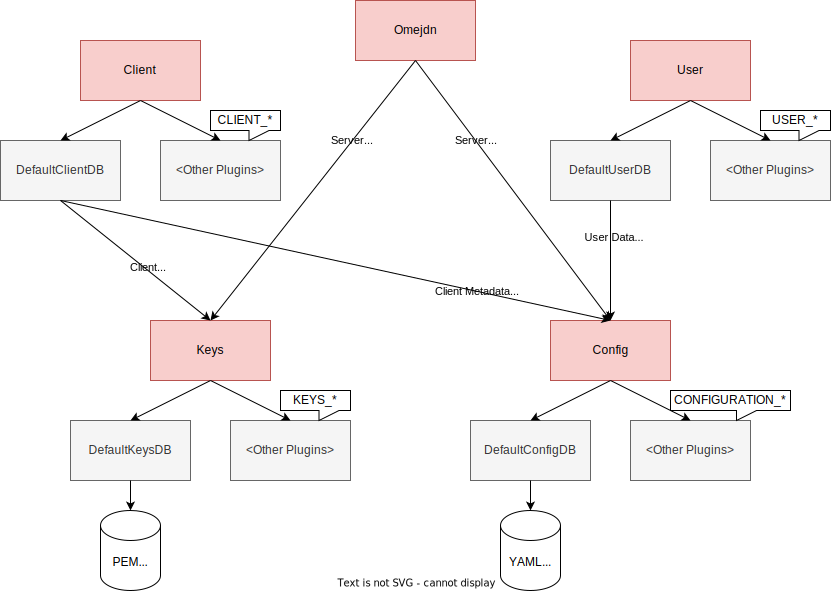

# Events

These are the events that are emitted by Omejdn.
You may hook into any one of them by using

```ruby
def event_handler(bind)
    # Edit the binding context
    # E.g. using bind.local_variable_get(:var)
    # or bind.local_variable_set(:var)
end

PluginLoader.register('<desired_event>', :event_handler)
```

The event_handler will be called every time Omejdn comes across

```ruby
PluginLoader.fire('<desired_event>', binding)
```

This allows you to directly edit any values in the caller's context.

Omejdn has two types of events.
State events allow you to hook into Omejdn whenever state is to be persisted,
while Flow events allow you to directly hook into the authorization flows.

## State Events

Omejdn maintains as little persistent state as possible.
Ignoring session data and caches, which are reset with each startup,
the following diagram illustrates how data is saved by Omejdn.

Each component (in red) sends out Events to store, update, or load data.
These are then acted upon by plugins.
Default plugins are included in Omejdn's Core code
(usually in the same file as the component itself).



The default implementations for Keys
(keys and any other cryptographic material such as certificates)
and Config (all other configuration data)
persist state by writing it to disk in an easy to handle format.
The components are neither designed to be efficient,
nor to support large numbers of clients and users.
They are designed for data that does not change often,
such as the server configuration.

For this reason, if you have a larger deployment,
you might also want to re-implement the Client and User plugins,
whose default implementations are just delegating their data to dedicated configuration sections.

### Configuration Events

Configuration data is stored in `section`s, which can be read and overwritten as a whole.
Each `section`'s content can be given as either a hash or an array.
The default implementation saves each section as YAML in `/config/<section>.yml`.

- CONFIGURATION_STORE

Should overwrite a section identified by **section** with **data**.

- CONFIGURATION_LOAD

Should return the content of section **section**, or **fallback** if no data is stored yet.

### Cryptographic Material Events

Keys and certificates are stored with two identifiers.
A `target_type` gives the type of entity holding the key or certificate (e.g. `omejdn`),
while the `target` specifies an identifier for that specific key or certificate (or both).
Omejdn handles key material as hashes with the keys `sk` and `pk` for the secret and public key,
`kid` for a key id, and `certs` for an array of certificates representing a certificate chain.
The default implementation saves secret keys and certificates as PEM in `/keys/<target_type>/<target>.{pem,cert}`.

- KEYS_STORE

Should store the key material **key_material** for the given **target_type** and **target**.

- KEYS_LOAD

Should return the key material for the given **target_type** and **target**.
If **create_key** is `true` and no key stored yet, a new key should be created and stored.

- KEYS_LOAD_ALL

Should return an array of all key material for the given **target_type**.

### Client Events

Clients are objects in Omejdn identified by their `client_id`, which is part of their `metadata`.
They also have an attribute `backend`.
Plugins implementing these events should set the backend of returned clients to an identifier for the plugin,
and drop any events presenting them clients from other plugins, returning `nil`.
The default implementation stores clients in a dedicated config section
and defines a `target_type` for clients to store keys.

- CLIENT_GET

Should return the client identified by `client_id`, or `nil` if not found.

- CLIENT_GET_ALL

Should return an array of all stored clients.

- CLIENT_CREATE

Should store the client **client**, if the **client_backend** is correct.

- CLIENT_UPDATE

Should replace that client with **client**,
which has the same `client_id`, if it is stored by this plugin.

- CLIENT_DELETE

Should delete the client identified by **client_id**, if stored by this plugin.

#### Client Authentication Events

- CLIENT_AUTHENTICATION_CERTIFICATE_GET

Should return the certificate of **client**.

- CLIENT_AUTHENTICATION_CERTIFICATE_UPDATE

Should replace the certificate of **client** with **new_cert**.
A value of `nil` indicates that the certificate should be deleted.

### User Events

Users are objects in Omejdn identified by their `username`.
They also have an attribute `backend`.
Plugins implementing these events should set the backend of returned users to an identifier for the plugin,
and drop any events presenting them users from other plugins, returning `nil`.
The default implementation stores clients in a dedicated config section.

- USER_GET

Should return the user identified by **username**.

- USER_GET_ALL

Should return an array of all stored users.

- USER_CREATE

Should store the user **user**, if the **user_backend** is correct.

- USER_UPDATE

Should replace that user with **user**,
which has the same **username**, if it is stored by this plugin.

- USER_DELETE

Should delete the user identified by **username**, if stored by this plugin.

#### User Authentication Events

N.B. Avoid storing user passwords as plain text.
A function `User.string_to_pass_hash(password)` is provided to hash passwords.
Passwords can be verified against hashes using `==`.

- USER_AUTHENTICATION_PASSWORD_CHANGE

Should replace the password of **user** with **password**.

- USER_AUTHENTICATION_PASSWORD_VERIFY

Should return `true` if **password** is likely the **user**'s password,
and `false` otherwise.

## Flow Events

### TOKEN_CREATED_ACCESS_TOKEN

Fired once the core access token is created.
You may edit the token using the local variable `token`.

### TOKEN_CREATED_ID_TOKEN

Fired once the core id token is created.
You may edit the token using the local variable `token`.

### AUTHORIZATION_LOGIN_STARTED

## Plugin Events

Plugins may define their own events and call them when appropriate.
These Events should follow the naming convention `PLUGIN_<pluginname>_<eventname>`, with everything capitalized.